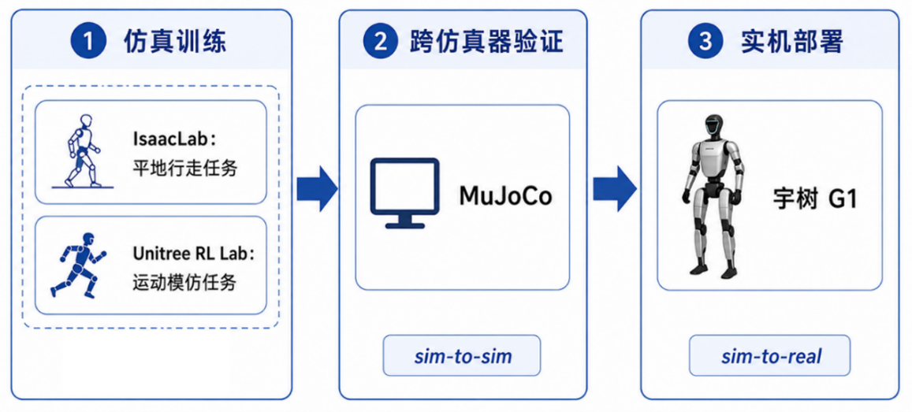
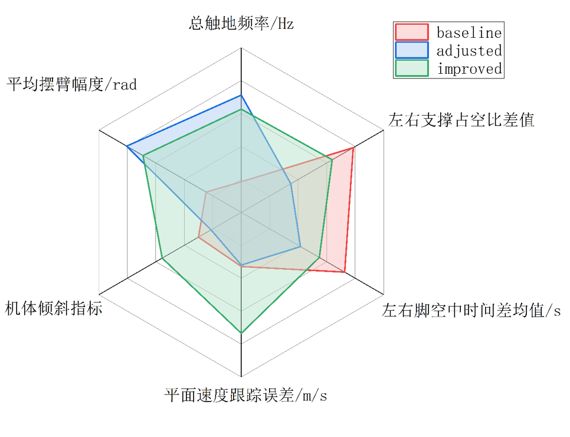
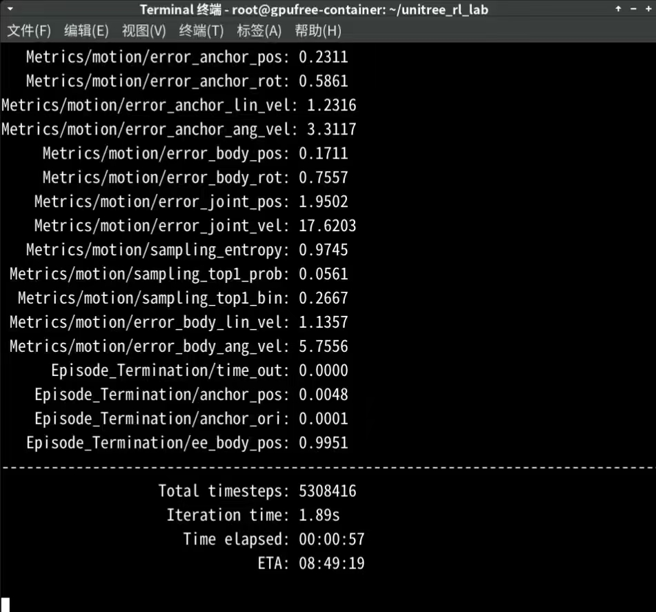
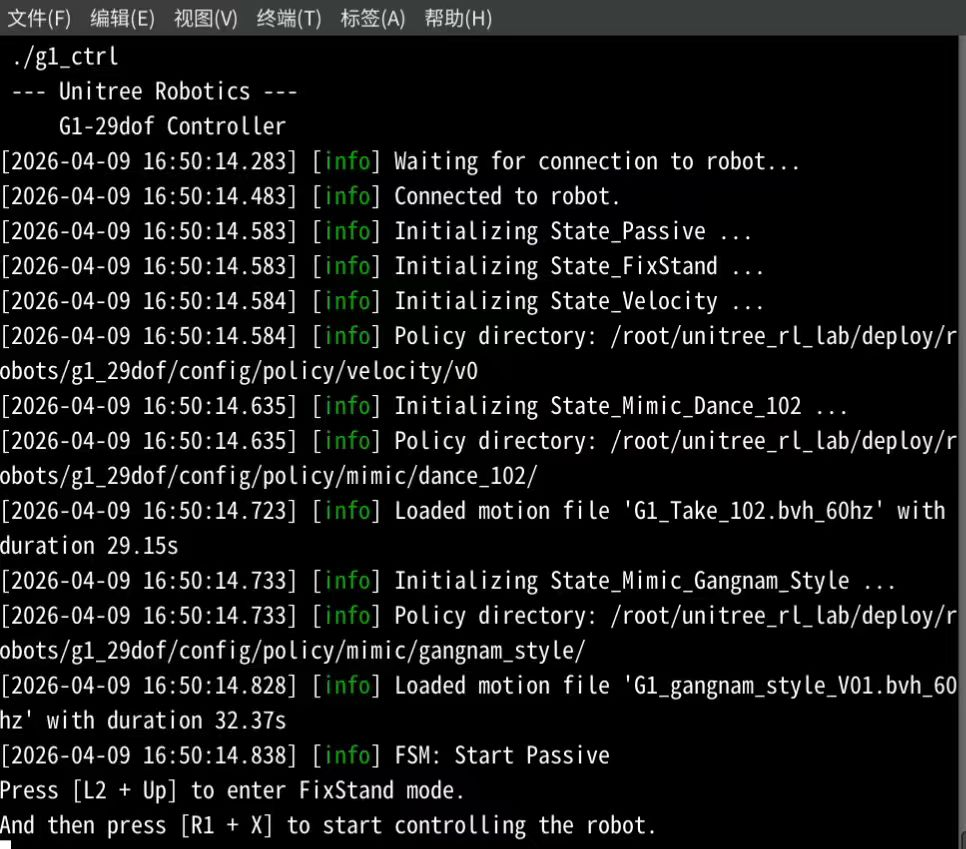

基于强化学习的人形机器人运动控制研究

本项目围绕人形机器人运动控制问题展开，研究对象为宇树G1人形机器人，主要目标是利用强化学习方法实现较为稳定、自然的平地行走控制，并进一步探索面向23自由度机器人模型的动作模仿控制。项目基于IsaacLab、Unitree RL Lab和MuJoCo等仿真平台完成训练、测试与迁移验证，重点关注奖励函数设计、机器人模型适配以及仿真到仿真的控制效果验证。

1. 研究背景与目标
人形机器人具有接近人类的身体结构，能够适应为人类设计的复杂环境，因此在服务机器人、工业协作和具身智能等方向具有重要应用价值。然而，由于人形机器人自由度高、动力学耦合强、平衡控制难度大，其运动控制仍然是一个具有挑战性的问题。传统控制方法通常依赖较强的人工建模与参数调节，而强化学习能够通过机器人与环境的交互自动学习控制策略，因此逐渐成为人形机器人运动控制中的重要方法。

本项目主要围绕两个研究任务展开：一是基于IsaacLab平台训练G1人形机器人完成平地行走；二是基于Unitree RL Lab对23自由度G1模型进行动作模仿控制适配。研究重点在于结合具体机器人结构和任务需求，对训练环境、奖励函数和模型配置进行改进，使控制策略在步态自然性、稳定性和动作跟踪效果上得到提升。

2. 方法与系统设计
在平地行走研究中，项目采用PPO作为核心强化学习算法。训练过程基于IsaacLab构建仿真环境，由环境提供机器人观测、动作空间、奖励函数和终止条件，并通过rsl_rl完成策略网络训练。针对训练过程中出现的高频碎步、摆臂不足和步态不自然等问题，项目在原有奖励项基础上设计了辅助奖励函数，包括步频惩罚、左右脚空中时间不对称惩罚以及髋膝关节不对称惩罚，用于引导机器人形成更自然、更稳定的步态，具体函数项以及设计思路可在论文中3.5节找到，此处便不再详细展开。最终的奖励函数权重配置如下，未出现函数项采用默认权重。

| 奖励项 | IsaacLab源码权重 | 优化方案权重 |
| ------ | ------ | ------ |
| 速度跟踪奖励 | 1.0 | 1.5 |
| 单足站立时间奖励 | 0.8 | 3.0 |
| 手臂关节约束 | -0.1 | -0.05 |
| 左右脚时间不对称惩罚 | 无 | -0.5 |
| 步频惩罚 | 无 | -0.01 |
| 髋俯仰角不对称惩罚 | 无 | -0.5 |
| 膝关节不对称惩罚 | 无 | -0.5 |

后续采用unitree_rl_lab进行奖励模块（上表最后四项）验证时，仍沿用了上述权重配置。

在动作模仿控制研究中，项目基于Unitree RL Lab对官方G1模型进行23自由度适配。由于实际使用的机器人模型缺少部分腰部和腕部自由度，项目需要重新整理关节映射、动作数据格式和末端身体部位配置，使参考动作能够正确作用于目标机器人模型。在此基础上，进一步针对模仿训练中出现的支撑不稳定和躯干姿态偏移问题，加入基座姿态约束和左右脚承载平衡等辅助奖励项，提高动作模仿过程中的稳定性，具体函数项以及设计思路可在论文中4.4节找到，此处便不再详细展开。最终的奖励函数权重配置如下，未出现函数项采用默认权重。unitree_rl_lab中23自由度机器人的平地行走初始权重设置由Github用户@HirotoUsuba提供。

| 新增奖励项 | 权重 | 作用 |
| ------ | ------ | ------ |
| 基座横滚-俯仰惩罚 | 0.3 | 改善单腿支撑阶段整体稳定性 |
| 单足站立时间奖励 | 0.08 | 减少支撑相中的突然趔趄 |
| 手臂关节约束 | 0.15 | 改善左腿单支撑时的横向稳定性 |
| 左右脚时间不对称惩罚 | 0.08 | 减弱对单侧支撑腿的过度依赖 |


最后，从单仿真器IsaacLab到异构仿真器MuJoCo、对两种策略进行跨仿真器验证，最后部署宇树G1实机，完成sim-to-real。
<p align="center">
  
  <br>
  <b>技术路线</b>
</p>

3. 实验结果与视频展示
平地行走实验表明，经过奖励函数调整后，机器人步态频率明显降低，高频碎步现象得到缓解；同时，机器人在行走过程中躯干姿态更加稳定，摆臂幅度有所增加，整体运动效果更加自然。相比原始训练结果，优化后的策略在速度跟踪误差、身体倾斜程度和步态对称性方面均表现出更好的综合效果。
<p align="center">
  
  <br>
  <b>平地行走策略指标对比图</b>
</p>

<table>
  <tr>
    <td align="center" width="50%">
      <video src="assets/baseline.mp4" controls width="100%"></video>
      <br>
      <b>baseline</b>
    </td>
    <td align="center" width="50%">
      <video src="assets/improved.mp4" controls width="100%"></video>
      <br>
      <b>inproved</b>
    </td>
  </tr>
</table>

在动作模仿实验中，23自由度模型能够较好地跟踪参考动作，并在MuJoCo仿真环境中完成动作回放。经过模型适配和辅助奖励函数优化后，机器人左腿支撑不稳、身体偏移等问题得到改善，动作模仿过程更加稳定，说明所设计的模型适配方案和奖励改进具有一定有效性。
<table>
  <tr>
    <td align="center" width="50%">
      <video src="assets/102baseline.mp4" controls width="100%"></video>
      <br>
      <b>baseline</b>
    </td>
    <td align="center" width="50%">
      <video src="assets/102improved.mp4" controls width="100%"></video>
      <br>
      <b>inproved</b>
    </td>
  </tr>
</table>

sim-to-sim验证在本文研究中不仅是实机部署前的安全测试环节，也是发现策略隐藏问题的重要手段。对于平地行走研究，它主要用于确认策略在异构仿真器中的稳定性；对于动作模仿控制研究，它还进一步暴露了训练阶段不易观察到的支撑不稳定和动作协调问题。得益于控制器与仿真器的解耦运行，通过这种逐级验证流程，最终完成了两类人形机器人运动控制策略的sim-to-real部署验证。
<table>
  <tr>
    <td align="center" width="50%">
      <video src="assets/locomotion.mp4" controls width="100%"></video>
      <br>
      <b>locomotion</b>
    </td>
    <td align="center" width="50%">
      <video src="assets/mimic.mp4" controls width="100%"></video>
      <br>
      <b>mimic</b>
    </td>
  </tr>
</table>

4. 代码资源及部署流程介绍
本项目基于英伟达的IsaacLab平台进行平地行走控制研究，基于unitree_rl_lab进行平地行走控制的验证以及运动模仿控制研究，具体的仓库链接如下。
IssacLab网址：https://isaac-sim.github.io/IsaacLab/main/index.html
获取unitree_rl_lab仓库地址：https://github.com/unitreerobotics/unitree_rl_lab.git
本研究代码仓库地址：已将我更改过的unitree_rl_lab仓库放进文件夹。

如果是初步尝试强化学习的调参和奖励设计、或者研究奖励模块的有效性，建议使用IsaacLab中的机器人简化模型进行训练测试，这将会极大程度减轻训练成本。本研究后续采用unitree_rl_lab进行部署，因为IsaacLab仓库中的部署环节缺失，而unitree_rl_lab中部署流程较为成熟。由于unitree_rl_lab中缺少23自由度的训练以及部署流程，可以直接拷贝本研究的代码仓库，并参考unitree_rl_lab官方教程进行配置。

为保证训练成功，请务根据官方教程下载并配置IsaacLab以及unitree_rl_lab仓库，并根据各自仓库的README配置环境。这部分是最容易出错的，也是训练的前提，请一定紧跟官方教程。如果遇到报错，可查询github或CSDN，基本都有解答。

由于C++控制器具有运行效率高等优势，且实机控制所采用的为手柄，请配置C++控制器并在sim2sim验证时使用Xbox或Switch手柄。在跑代码之前，请先仔细阅读第五部分，或许会对学习过程有所帮助。

当训练环境配置好后，可以通过指令查询目前所有的可训练任务。
```bash
./unitree_rl_lab.sh -l
```
本实验中采用的是23自由度宇树G1，已经创建好了。
locomotion任务：Unitree-G1-23dof-Velocity
mimic任务：Unitree-G1-23dof-Mimic-Dance-102

在每个任务中，可以通过路径找到他们所在的位置。以locomotion任务为例，可以在/unitree_rl_lab/source/unitree_rl_lab/unitree_rl_lab/tasks/locomotion/robots/g1/23dof/路径的velocity_env_cfg.py文件查看目前奖励项权重，包括域随机化等配置；如果想要新增奖励项或者修改奖励项，可以在/unitree_rl_lab/source/unitree_rl_lab/unitree_rl_lab/tasks/locomotion/mdp/路径的rewards.py文件进行修改。为保证代码的节俭性，建议在新增奖励时，新创建一个文件用于存储奖励函数，只需在后面的任务文件中添加调用即可。本研究针对locomotion和mimic设计的奖励代码均存放于对应路径的奖励文件之中。

本研究采用的强化学习算法为PPO，直接通过rsl_rl框架调用即可。这里不需要做任何处理，如果对PPO超参数有调整需求可以直接通过/root/Desktop/unitree_rl_lab/source/unitree_rl_lab/unitree_rl_lab/tasks/locomotion/agents/路径的rsl_rl_ppo_cfg.py文件直接修改。本研究在算法部分进行了参数对比实验，目前框架自带的超参数较为稳定，并不需要额外修改。

随后就可以开始训练，这里以23自由度G1机器人locomotion任务为例，训练的指令如下。
```bash
python scripts/rsl_rl/train.py --headless --task Unitree-G1-23dof-Velocity
```

其中--headless为无头模式，即没有画面的渲染，建议添加，因为这样可以提高训练效率。

当terminal出现与以下类似的界面，说明目前已经可以正常训练。可以查看显卡的占用情况以便于后续的并行环境数处理。
<p align="center">
  
  <br>
</p>

在训练过程中，可以使用指令tensorboard --logdir=path/to/your/log/directory（需要替换为自己训练日志的实际路径）实时查看tensorboard训练曲线。如果在训练了数百轮后机器人仍无法站立，即“摔倒造成训练终止”的概率为1或接近1，则说明目前奖励设计对于智能体过于极端，这种情况应当提前终止并修改奖励；当总奖励几乎不再上升，说明已经较为接近最优解，也可以提前终止训练以节省算力。

在训练结束后，使用play指令可以从训练得到的模型中分离出actor网络。
```bash
python scripts/rsl_rl/play.py --task Unitree-G1-23dof-Velocity
```
此时指令不添加headless，可以直观看到训练结果模型的视觉效果，添加--video可以录制默认为50帧的视频，再添加--video 300可以录制6秒视频。此外，由于在训练过程中一般每过一定的轮数就会保存一个模型，可以根据曲线指定模型进行play操作，从而得到对应模型的actor网络。

sim-to-sim部署：
采用C++控制器，根据unitree_rl_lab的教程配置好部署所需要的环境。
```bash
# Install dependencies
sudo apt install -y libyaml-cpp-dev libboost-all-dev libeigen3-dev libspdlog-dev libfmt-dev
# Install unitree_sdk2
git clone git@github.com:unitreerobotics/unitree_sdk2.git
cd unitree_sdk2
mkdir build && cd build
cmake .. -DBUILD_EXAMPLES=OFF # Install on the /usr/local directory
sudo make install
# Compile the robot_controller
cd unitree_rl_lab/deploy/robots/g1_29dof # or other robots
mkdir build && cd build
cmake .. && make
```
并按照教程安装unitree_mujoco。

在开始控制之前，首先需要将训练好的模型网络以及其部署时的映射文件deploy.yaml文件放置在部署文件之中。具体文件均存放于/unitree_rl_lab/deploy/robots/g1_23dof/config/policy/文件夹中。此外，还有一些用于23自由度的适配文件，比如/unitree_rl_lab/deploy/robots/g1_23dof/include/路径下的State_Mimic.h文件、/unitree_rl_lab/deploy/robots/g1_23dof/src/路径下的State_Mimic.cpp文件、State_RLBase.cpp均已完成针对23自由度的适配。

由于仿真器与控制器解耦，因此只需要将仿真机设定为23自由度的场景以及23自由度机器人的数字文件即可，控制器即c++控制器。这一部分在/unitree_mujoco/simulate/路径下的config.yaml文件中，此外需要设定手柄、设置虚拟吊带，这部分直接照搬即可。
```bash
robot: "g1"  # Robot name, "go2", "b2", "b2w", "h1", "go2w", "g1"
robot_scene: "scene_23dof.xml" # Robot scene, /unitree_robots/[robot]/scene.xml 

domain_id: 0  # Domain id
interface: "lo" # Interface 

use_joystick: 1 # Simulate Unitree WirelessController using a gamepad
joystick_type: "xbox" # support "xbox" and "switch" gamepad layout
joystick_device: "/dev/input/js0" # Device path
joystick_bits: 16 # Some game controllers may only have 8-bit accuracy

print_scene_information: 1 # Print link, joint and sensors information of robot

enable_elastic_band: 1 # Virtual spring band, used for lifting g1
```

通过两个terminal分别启动仿真器和控制器，仿真器启动指令如下。
```bash
# start simulation
cd unitree_mujoco/simulate/build
./unitree_mujoco -i 0 -n eth0 -r g1 -s scene_23dof.xml
```
控制器启动指令如下。
```bash
cd unitree_rl_lab/deploy/robots/g1_23dof/build
./g1_ctrl
```

当出现以下界面，即说明仿真器与控制器之间建立了通讯，可实现仿真控制。
<p align="center">
  
  <br>
</p>

/unitree_rl_lab/deploy/robots/g1_23dof/config/地址下的config.yaml文件是仿真控制过程中的说明书，其包括了各种模式的切换说明，以及各个网络文件和映射文件的所在地址。根据说明，通过手柄输入信号，即可实现机器人不同状态之间的切换。仿真器中的机器人在启动时自身是0力矩模式，在连接成功后进入被动模式，这时需要L2+Up使其进入站立模式。需要注意的是0力矩模式、被动模式和站立模式下机器人都无法保持平衡，需要按数字键9将其吊起。最后按R1+X进入控制模式。

控制模式下机器人可以保持平衡，这时可以再按9解除虚拟吊绳，此时通过手柄的摇杆即可实现前后左右的行走控制。而对于运动模仿控制也是如此，同样根据说明文件config.yaml，只需要在控制模式按L2+Down即可进入运动模仿控制，此时机器人可以实现运动模仿的运动，运动结束后恢复控制模式。具体的状态切换操作请查看config.yaml文件。

sim-to-real部署：
与sim-to-real类似，控制器仍是C++控制器，只是仿真器从mujoco变成了实机。通过远程连接到人形机器人的机载电脑后，同sim-to-sim一样配置好文件结构，将需要的网络文件和映射文件放到所需位置，编译控制器成功后即可控制机器人。而对于人形实机这个仿真器，需要启动后进入阻尼模式，再通过手柄信号使其站立。这一部分可以在实机的手柄键盘上找到需要的按键组合说明。

与仿真实验相类似，最初机器人不受控制，无法保持稳定，所以一定需要龙门架将其吊起，以实现仿真中虚拟吊带的作用。当电脑上启动控制器，此时人形机器人会进入控制模式，并根据手柄发出信号实现行走、运动模仿等步骤。

需要特别注意的是，由于在电脑断开控制器时，机器人不再能够自主保持平衡，如果没有安全保护会直接倒下。所以在机器人进入控制模式后，务必不要贸然断开控制器，一定要保证机器人被龙门吊吊紧的状态下再断开控制器。由于sim-to-sim和sim-to-real的说明文件一致，因此一定要在仿真实验中熟练了按键操作后再进行实机实验。

在实验室的G1实机也已经配置好训练好的locomotion和mimic策略，控制器也已经编译好，直接远程连接机载电脑后启动控制器即可实现对实机的控制效果。请务必遵循sim-to-real的步骤，独自操控实机时请勿解开龙门架保护。

5. RL学习心得
强化学习是一种通过设定显式奖励，来引导智能体在训练过程中通过最大化奖励来实现学习的工具。这看似很简单，实则无论是构造奖励函数，还是设计权重，都是相当繁琐复杂的工作，尤其是对于人形机器人这样一个高自由度，强耦合的智能体，即使是在前人的工作上加一项不合适的奖励函数，或者将某一项奖励的权重进行大程度的改变，最终都有可能导致训练结果不尽人意，甚至出现崩溃。

原因很简单，单纯通过强化学习，我们无法告诉智能体我们希望它怎么做，只能告诉它怎样做会有奖励。在数以亿计的训练步中，智能体会千方百计的想办法钻空子来得到奖励。就以我最初的平地行走控制训练（人形的locomotion）举例，我发现IsaacLab中源码的训练结果，机器人出现了高频碎步，手臂紧贴躯干的现象，这并不是优秀的步态。因此我提高了原有奖励中的“单足站立时间奖励”的权重，希望通过这一项调整，使得机器人在训练过程中更愿意通过低频的步态来实现行走，更贴合我们脑海中的理想步态的样子。

但是实际效果可以说和想象的大相径庭。无论是由于23自由度机器人自身的结构限制所影响，还是单一奖励权重发生重大变化的风险导致，机器人出现了明显的跛行现象：步频确实降低了，因为想要拿到更多的“单足站立时间奖励”，但是单腿摆动相时间增长，机器人走起路来就不稳定了，所以就会倾向于以一条腿为主支撑腿的“一瘸一拐”式行走。对于机器人来说，他既最大化了奖励，又避免了行走不稳定的惩罚。但是对于研究者来说，这样的不对称步态并不是我们想要的。

这只是我在训练过程中出现的众多问题之一，但是通过这个例子可以看出，强化学习的奖励项能够引导机器人在训练过程中，朝着最优解一点一点的梯度更新。但是即便是训练得到了最优解，这个最优解未必是我们想要的。也许奖励项的组成和权重不合适，将智能体引导到了错误的方向上；也许引导作用太大了，智能体错过了我们想要的解，而一味的奔向了它认为的、也就是奖励函数所决定的最优解。

所以在强化学习训练过程中，总奖励的上升不代表训练的成功，训练得到的最终模型的神经网络效果不好也不叫失败。请务必牢记奖励项的引导作用，从而去适当调整奖励项、设计奖励项，调整奖励函数。不要等到总奖励爬不动了就认为当前模型最好。实际上根据本项目经验，当总奖励爬升过程中出现了明显的转折，即奖励不再猛涨，而是进入了平缓的上升期，这个时候要多测试几组模型的网络，也许想要的最优解就藏在这上升期之中。

仿真训练中的环境和传感器都是完美的，而现实中的环境是复杂多变的，因此强化学习训练中普遍加入了域随机化，即在训练中就通过随机化参数来模拟复杂的现实环境，从而提升策略鲁棒性。在我所使用的两个仓库，域随机化参数都是设计好的，因此训练时只需要去关注实际效果，而不需要担心机器人站不住而出现崩溃的情况。当然域随机化并不是越随机越好，过大的参数范围会导致训练过程中收敛变得困难。


6. 总结与展望
本项目完成了基于强化学习的人形机器人平地行走控制与动作模仿控制研究，构建了从训练环境搭建、奖励函数改进、23自由度模型适配到仿真测试验证的完整流程。实验结果表明，结合机器人结构特点设计辅助奖励函数，能够有效改善步态自然性和控制稳定性。

目前工作主要存在的不足是过于依赖手工奖励，训练效率低；运动模仿控制中主要评价标准是视觉效果，缺乏客观的评价指标。

后续工作可进一步面向复杂地形、外部扰动和真实机器人部署开展研究，提高控制策略在真实环境中的鲁棒性与泛化能力。


7. 补充说明

7.1 所有可训练任务

本项目基于 unitree_rl_lab 注册了以下任务，可通过 `./unitree_rl_lab.sh -l` 查看：

| 类别 | 任务名称 | 自由度 |
|------|----------|--------|
| Locomotion | Unitree-G1-23dof-Velocity | 23 DOF |
| Locomotion | Unitree-G1-29dof-Velocity | 29 DOF |
| Mimic | Unitree-G1-23dof-Mimic-Dance-102 | 23 DOF |
| Mimic | Unitree-G1-29dof-Mimic-Dance-102 | 29 DOF |
| Mimic | Unitree-G1-29dof-Mimic-Gangnam-Style | 29 DOF |

其中 29 自由度（29DOF）模型相比 23DOF 增加了腰部和腕部关节，动作空间更大。Gangnam Style 是除 Dance-102 之外的另一组动作模仿参考数据。

7.2 已训练策略模型

所有训练好的策略已导出为 ONNX 格式，存放在 `deploy/robots/` 下对应机器人的 `config/policy/` 路径中：

| 模型文件 | 大小 | 说明 |
|----------|------|------|
| `deploy/robots/g1_23dof/config/policy/unitree_g1_23dof_velocity/exported/policy.onnx` | 1.5MB | 23DOF 平地行走策略 |
| `deploy/robots/g1_23dof/config/policy/mimic/dance_102/exported/policy.onnx` | 905KB | 23DOF Dance-102 动作模仿策略 |
| `deploy/robots/g1_29dof/config/policy/velocity/v0/exported/policy.onnx` | 1.6MB | 29DOF 平地行走策略 v0 |
| `deploy/robots/g1_29dof/config/policy/mimic/dance_102/exported/policy.onnx` | 968KB | 29DOF Dance-102 动作模仿策略 |
| `deploy/robots/g1_29dof/config/policy/mimic/gangnam_style/exported/policy.onnx` | 968KB | 29DOF Gangnam Style 动作模仿策略 |

每个策略目录下的 `params/` 子目录包含 `deploy.yaml` 部署映射文件及参考动作数据（`.npz` / `.csv`）。部署时需将对应策略文件夹的 `exported/policy.onnx` 和 `params/deploy.yaml` 放置在 C++ 控制器可读取的路径中。

7.3 unitree_rl_lab.sh 快捷命令

项目根目录下的 `unitree_rl_lab.sh` 封装了常用操作：

| 命令 | 说明 |
|------|------|
| `./unitree_rl_lab.sh -i` / `--install` | 安装 unitree_rl_lab 扩展并配置 conda 环境 |
| `./unitree_rl_lab.sh -l` / `--list` | 列出所有可训练任务 |
| `./unitree_rl_lab.sh -t` / `--train` | 启动训练（默认 headless 模式） |
| `./unitree_rl_lab.sh -p` / `--play` | 回放训练模型并导出 actor 网络 |

7.4 模型导出工具

`export_g1_model.py` 可从训练 checkpoint 中提取策略网络并导出为 `.pt` 文件，供仿真器加载：

```bash
python export_g1_model.py
```

脚本内部通过 `torch.load` 加载指定 checkpoint，提取 `model_state_dict` 中的 actor 网络后保存。使用前请根据实际 checkpoint 路径修改脚本中的文件路径。

7.5 Docker 部署

项目提供了 Docker 容器化部署方案，文件位于 `docker/` 目录：

- `Dockerfile` — 基于 Isaac Lab 基础镜像，自动安装 unitree_rl_lab 扩展
- `docker-compose.yaml` — 一键启动容器，挂载项目目录，配置 GPU 直通和 host 网络
- `.env.base` — 基础镜像名称等环境变量

使用方式：

```bash
cd docker
docker compose up -d
```

7.6 数据预处理脚本

`scripts/mimic/` 目录下提供了动作模仿数据的预处理工具：

| 脚本 | 说明 |
|------|------|
| `csv_to_npz.py` | 将 CSV 格式的参考动作数据转换为 NPZ 格式（29DOF） |
| `csv_to_npzfor23.py` | 将 CSV 格式的参考动作数据转换为 NPZ 格式（23DOF） |
| `generate_23dof_csv.py` | 从 29DOF 数据生成适配 23DOF 的 CSV |
| `replay_npz.py` | 在 MuJoCo 中回放 NPZ 格式的动作数据（29DOF） |
| `replay_npzfor23.py` | 在 MuJoCo 中回放 NPZ 格式的动作数据（23DOF） |

7.7 支持的机器人平台

deploy 目录下除 G1（23DOF / 29DOF）外，还包含以下宇树机器人的 C++ 控制器代码：H1、H1_2、B2、Go2、Go2W。这些控制器的编译和部署流程与 G1 一致，对应策略模型需单独训练后放入各自的 `config/policy/` 路径。